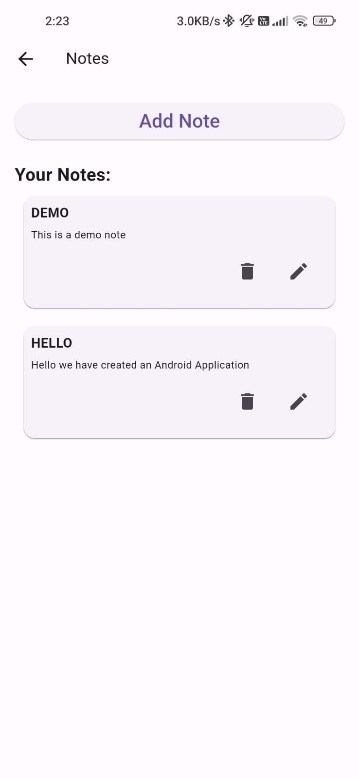
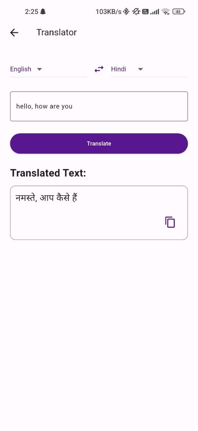
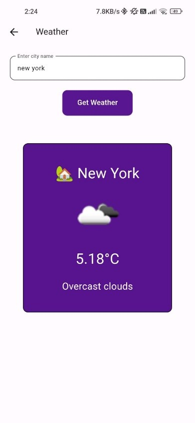
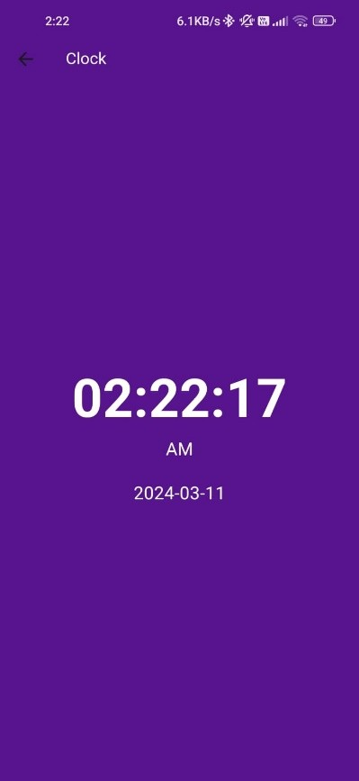

<h1 align="center">UtilVerse</h1>
<h3 align="center">📱 Multi-Utility Android Application Built with Flutter</h3>

<p align="center">
  <a href="https://github.com/husain-najmi-53/utilverse-flutter-app">
    
  </a>
  
</p>

---

## 🔍 Project Overview

**UtilVerse** is a mobile application designed to improve day-to-day productivity by offering multiple utility tools within one platform.  
It’s built using **Flutter (Dart)** and provides a clean, intuitive interface for users who want essential utilities without installing multiple apps.

---

## 🛠 Features

✔ Calculator utilities  
✔ Task Manager  
✔ Scheduling & reminders  
✔ Clean and polished UI

---

## 💡 What Problem This Solves

Instead of juggling multiple utility apps, users can access everyday tools from a **single consolidated app** — saving space, time, and effort.

---

## 🛠 Tech Stack

**Framework:** Flutter  
**Language:** Dart  
**Tools:** VS Code / Android Studio  
**Platforms:** Android

---

## 👨‍💻 My Role

- Designed and developed the full application architecture  
- Built UI components and utility logic  
- Performed testing and iterative debugging  
- Followed structured development workflow

---

## 📸 Screenshots

## 📸 Screenshots

<p align="center">
  
  
  
  
  
  
</p>


---

## 🚀 How to Run Locally

1. Clone the repo  
```bash
git clone https://github.com/husain-najmi-53/utilverse-flutter-app.git
```
2. Install dependencies
```bash
flutter pub get
```
3. Run app
```bash
flutter run
```
---
📫 Connect With Me

If you have questions, feel free to reach out:

📧 husainnajmi515253@gmail.com

🔗 https://linkedin.com/in/husainnajmi07